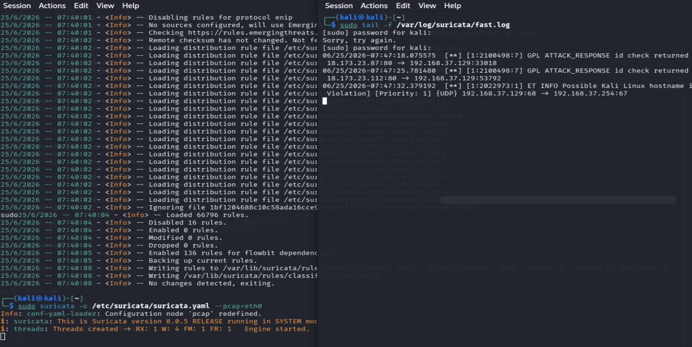

# Network Intrusion Detection System — Suricata

## Overview
Configured a network-based IDS using Suricata 8.0 on Kali Linux to monitor
live traffic, detect intrusions, and automatically block malicious IPs.

## Tools Used
- Suricata 8.0 (NIDS engine)
- Emerging Threats community ruleset via suricata-update
- Custom Snort-style detection rules
- iptables for auto-blocking
- pcap mode (VM compatible)

## Features
- Detects port scans, SSH brute force, SQL injection, ICMP floods
- Real-time alert logging via eve.json
- Auto-blocks attacker IPs using iptables on alert trigger

## How to Run
1. Install Suricata: `sudo apt install suricata -y`
2. Update rules: `sudo suricata-update`
3. Copy config: `sudo cp config/suricata.yaml /etc/suricata/suricata.yaml`
4. Copy rules: `sudo cp rules/local.rules /etc/suricata/rules/`
5. Start Suricata: `sudo suricata -c /etc/suricata/suricata.yaml --pcap=eth0`
6. Monitor alerts: `sudo tail -f /var/log/suricata/eve.json`

## Sample Alert Output
See `logs/sample-alerts.json`

## Screenshots

